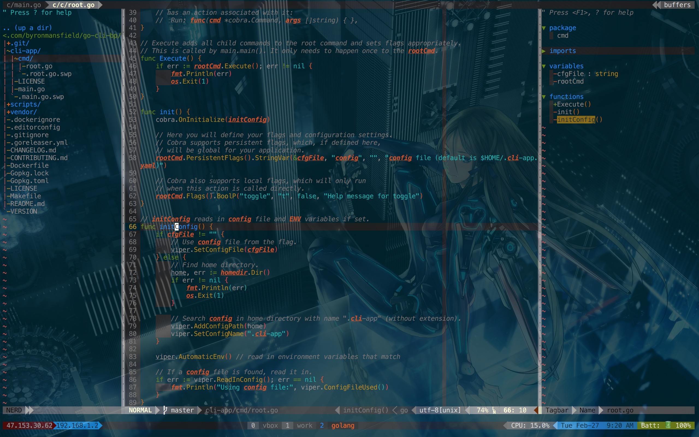

# My personal Vim setup



## About

This is to help me keep all my computers synced and also to add some history tracking in case I need to revert. I am also using this as a way to leave notes for myself on setting it up every time I need to set up a new computer, and save myself time from googling around. Take what you like, contribute if you like (please send PR's). Right now I'd say that most of this is set up for OS X + iTerm2 with Tmux. I've started using Ubuntu more and have slowly started adding things that make it compatible with both.

## Current Feature Highlights

* [Pathogen](https://github.com/tpope/vim-pathogen) - for easily managing plugins as git submodules
* [NerdTree](https://github.com/scrooloose/nerdtree) - nice tree-view file browsing [C-n]
* [Rainbow Parentheses](https://github.com/kien/rainbow_parentheses.vim) - easily see when and where you are missing a closing bracket
* [Syntastic](https://github.com/scrooloose/syntastic) - syntax checking and correction helpers for most major languages
* [Solarized](http://ethanschoonover.com/solarized) - Solarized Dark Theme
* [Airline](https://github.com/bling/vim-airline) - Powerful Vim status bar light as air

just to name a few...

## Usage / Installation

### General

This should get you all the basics to get started

1. Clone .vim directory

```shell
git clone https://github.com/byronmansfield/dotvim.git ~/.vim
```

2. Install submodules

```shell
cd ~/.vim
git submodule init
git submodule update
```

3. Symlink vimrc

```shell
ln -s ~/.vim/vimrc ~/.vimrc
```

### Other

Until I get around to writing a bash script to do all this automagically for
me. There will be a few extra things you will need to install in order for this
full list of vim goodies to work.

#### Install YouCompleteMe

To completely install YouCompleteMe you need to do a few extra steps. I suggest
using their repo installication instructions in case something has changed.
Since I'm usually setting this up for myself, and I write C, Go and also some Typescript (for Angular2), my typical installation looks something like this.

Make sure we have CMake installed (preq for C lang support) via Homebrew

```shell
brew install CMake
```

Update the submodules

```shell
git submodule update --init --recursive
```

Then use their installer script with C and Go flags also making sure we have
typescript node module installed globally

```shell
cd ~/.vim/bundle/YouCompleteMe
./install.py --gocode-completer
npm install -g typescript
```

#### iTerm2 Solarized Theme

iTerm2 need the solarized theme as well in order for this to work. There are
a few choices, though the only one I have experience with and know for a fact
works is [iterm-colors](https://github.com/bahlo/iterm-colors). I'm sure the
others work just fine. I selected to get this one because it was the smalled
one I could find with solarized in it. Then you will need to go into your
iTerm2 preferences > profiles > colors > load presets. Then just import
solarized from the cloned iterm-colors repo.

#### Airline Support

In order to get the full on Airline support on a mac, you'll need to install
the missing [Menlo Powerline patched
fonts](https://github.com/abertsch/Menlo-for-Powerline).

```shell
git clone https://github.com/abertsch/Menlo-for-Powerline.git
```
* Double click the fonts to install them.
* Then set iTerm2 to use the Menlo fonts

## Notes

Use at your own risk. You may be eaten by a grue.

Other things to note. Using on OSX in iTerm2 + tmux can yield all kinds of weird things you will have to troubleshoot, such as copy and paste issues, italic font support, color theme settings, and many more fun things. I will try to annotate this more as I come across it. Some of this support overlaps to my [dotfile repo](https://github.com/byronmansfield/dotfiles). You may want to check there for some of these issues, tmux in particular.

## Wishlist

- [ ] write an installer script to handle some of the secondary installations

